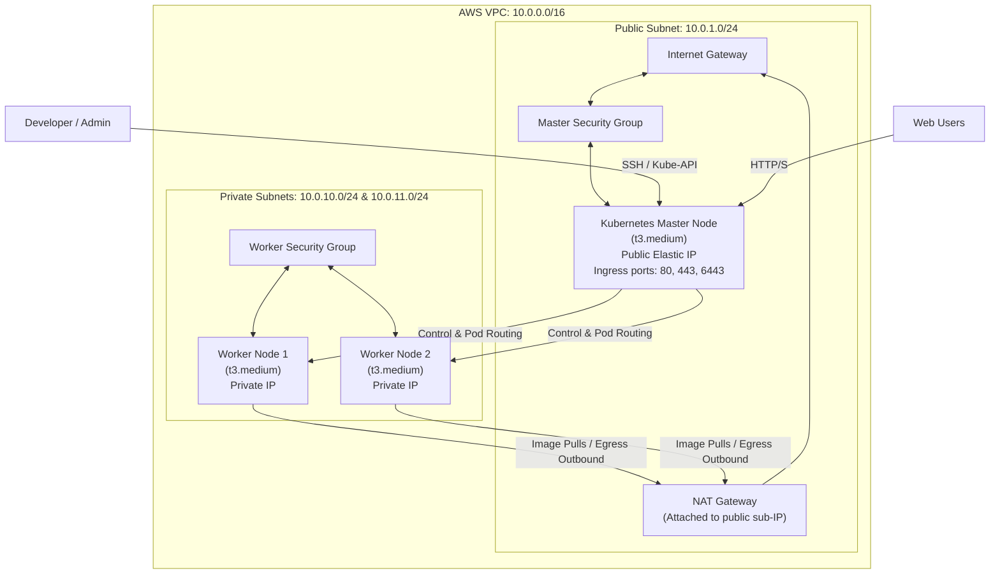

# Architecture Design & Technical Explanations

This document describes the design decisions, component roles, and financial estimations associated with the production-grade self-managed Kubernetes infrastructure on AWS.

---

## 1. Technological Rationales: Why This Stack?

### Why Terraform is Used (Infrastructure as Code)
* **Declarative Orchestration**: Terraform allows us to describe the *desired state* of AWS resources (VPC, Subnets, Security Groups, EC2s) in declarative configuration files. Terraform resolves dependencies and determines the optimal ordering of operations.
* **State Management**: Keeps track of resources via a state file (`terraform.tfstate`), enabling dry-runs (`terraform plan`), drift detection, and safe resource modification or deletion.
* **Modular Portability**: Simplifies scaling and multi-region replication. Our custom modules (`vpc`, `security_groups`, `ec2`) can be instantiated instantly for testing, staging, or production envs.
* **Terraform vs. Alternatives**: Unlike CloudFormation (AWS-exclusive) or Pulumi (imperative coding), Terraform uses standard HCL (HashiCorp Configuration Language), offering multi-cloud extensibility and a huge ecosystem of community providers.

### Why Ansible is Used (Configuration Management)
* **Agentless Simplicity**: Ansible runs over standard SSH. There are no client-side agents or master daemons to maintain on the target EC2 nodes, reducing CPU overhead and keeping instances lean.
* **Idempotency**: Ansible tasks are designed to check the remote system's current state and *only* apply changes if the actual state differs from the desired configuration (e.g. only initializing kubeadm if Kubeconfig doesn't exist).
* **Rich Module Ecosystem**: Offers native system-level controls, apt repositories setup, file template rendering (Jinja2), and service management configurations out-of-the-box.
* **Ansible vs. Shell Scripts / Chef / Puppet**: Shell scripts lack built-in idempotency and state safety. Chef and Puppet require complex client-server infrastructure and custom ruby code. Ansible strikes the ideal balance with human-readable YAML playbooks.

### Why Kubernetes is Used (Container Orchestration)
* **Self-Healing Capability**: Restarts failed containers, replaces pods when nodes crash, and kills containers that fail readiness/liveness health checks.
* **Service Discovery & Load Balancing**: Exposes applications automatically using DNS names or ClusterIP IPs and handles internal routing.
* **Automated Declarative Scaling**: Scales application pods up or down dynamically using HPAs (Horizontal Pod Autoscalers) based on resource loads (CPU/Memory metrics).
* **Zero-Downtime Deployments**: Handles rolling updates with sophisticated scheduling parameters (`maxSurge`, `maxUnavailable`), ensuring continuous uptime during release cycles.

---

## 2. Self-Managed Kubernetes vs. Managed AWS EKS

The table below contrasts our self-managed EC2 cluster (kubeadm-based) with the managed Amazon Elastic Kubernetes Service (EKS):

| Feature | Self-Managed Kubernetes (EC2 + kubeadm) | Managed AWS EKS |
| :--- | :--- | :--- |
| **Control Plane Fee** | **$0 / month** (Run control plane on your own EC2 nodes) | **$73.00 / month** ($0.10/hr flat cluster fee) |
| **Control Plane Management**| **Manual**: You must provision, configure, backup, and restore `etcd` and secure `kube-apiserver` components. | **Automated**: AWS manages, scales, and backs up control plane elements across multiple Availability Zones. |
| **OS & Control Plane Customization**| **Total Freedom**: You can configure any kernel parameters, API server flags, customize etcd, or run any CNI or OS flavor. | **Restricted**: AWS manages the API server and OS settings. Customization is limited to supported extensions. |
| **Cluster Upgrades** | **Manual**: Execute manual step-by-step rolling upgrades using `kubeadm` commands on nodes. | **Semi-Automated**: Trigger node group and control plane upgrades with single commands or AWS console clicks. |
| **Node Management** | **Manual**: Handle OS patching, container runtime configurations, and docker/kubelet updates yourself. | **Automated**: EKS Managed Node Groups automate provisioning, draining, and termination of EC2 instances. |
| **Egress & Cloud Lock-in** | **Low**: Highly portable. The Ansible roles can build identical clusters on bare-metal, Azure, or GCP. | **High**: Deeply integrated with AWS IAM, VPC CNI, ALB controllers, and CloudWatch. |

---

## 3. Comprehensive AWS Cost Estimation

This cost model assumes deployment in the `us-east-1` region (prices are subject to current AWS region schedules).

### Monthly Cost Breakdown (Estimation)

| AWS Resource | Details | Quantity | Monthly Cost (USD) |
| :--- | :--- | :--- | :--- |
| **EC2 Instances** | `t3.medium` instances (2 vCPUs, 4GB RAM) for Master and Workers ($0.0416/hour each) | 3 | $91.10 |
| **EBS Storage** | gp3 volumes (30 GB per instance for root filesystem) at $0.08 per GB/month | 90 GB | $7.20 |
| **NAT Gateway** | Flat hourly charge for 1 NAT Gateway ($0.045/hour) | 1 | $32.85 |
| **Elastic IPs** | Attached to active Master instance and NAT Gateway (no idle charge) | 2 | $0.00 |
| **NAT Data Processing** | Outbound worker traffic processed by NAT (e.g. pulling Docker images, updates) | ~10 GB | $0.45 |
| **Total Estimated Cost** | **Without AWS Free Tier discounts** | | **$131.60 / month** |

### Cost Optimization Strategies for Development:
1. **Turn off instances off-hours**: Use AWS instance scheduler to stop the EC2 instances at night, which cuts compute costs by ~60%.
2. **Workers in Public Subnets (No NAT)**: If absolute production security isolation is not required for testing, workers can reside in public subnets with no public IPs (routing directly via Internet Gateway via egress-only tables). This entirely removes the NAT Gateway hourly charge, saving **$32.85/month**.

---

## 4. Logical Network Architecture

