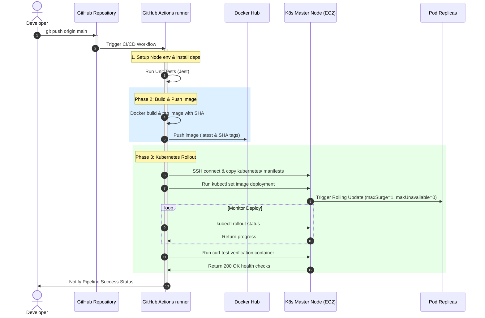

# Automated Deployment Flow

This document details the step-by-step mechanics of the GitHub Actions CI/CD automation pipeline.

---

## 1. Pipeline Sequence Diagram

The sequence of operations triggered by a developer push is visualized in the Mermaid diagram below:



---

## 2. In-Depth Step Explanations

### Step 1: Code Push
A developer pushes code changes to the `main` branch. The push contains changes in either the application directories (`app/**`), the manifests folder (`kubernetes/**`), or the workflow file itself.

### Step 2: GitHub Workflow Activation
GitHub's webhook instantly triggers the workflow defined in `.github/workflows/deploy.yml`. The GHA runner checks out the repository.

### Step 3: CI Tests & Quality Gate
The runner boots a Node.js environment, caches packages, installs dependencies using `npm ci` (ensuring deterministic package installs matching the lockfile), and runs `npm run test` (Jest unit tests). If any test fails, the runner halts and blocks deployment.

### Step 4: Multi-Stage Docker Compilation
If tests pass, the runner initiates a Docker build using Docker Buildx. It builds the image in standard multi-stage layers (compiling dependencies on alpine, running tests inside builder, discarding dev-dependencies, copying lean outputs into a final non-root alpine base). 

### Step 5: Dual Tag Image Push
The container is tagged twice:
1. `YOUR_USERNAME/node-app:latest`: Represents the current active release.
2. `YOUR_USERNAME/node-app:GIT_SHA`: A unique tag mapped to the specific git commit hash. This provides perfect auditability and enables instant rollback to specific releases.
The image is securely uploaded to Docker Hub.

### Step 6: Secure Bastion SSH Connection
The runner activates an SSH agent containing the decrypted private key (`EC2_SSH_PRIVATE_KEY` stored in GitHub secrets) and establishes a secure connection to the Kubernetes Master EC2 (using its Elastic IP). Manifests inside `kubernetes/` are synced onto the master filesystem using `scp`.

### Step 7: Dynamic Deployment Tag Injector
Using remote shell execution, the runner triggers:
```bash
kubectl set image -f kubernetes/deployment.yaml node-app=docker.io/USERNAME/node-app:GIT_SHA
```
It patches the YAML manifest on-the-fly to reference the exact `GIT_SHA` tag, replaces the `PLACEHOLDER_GIT_SHA` metadata variable, and applies it to the active API server.

### Step 8: Zero-Downtime Rolling Update Orchestration
The Kubernetes Master node reads the updated manifest. Because we set `maxSurge: 1` and `maxUnavailable: 0`:
1. Kubernetes spins up one new Pod container containing the new code version.
2. Once the new pod passes its `readinessProbe` (10 seconds startup delay), it is added to the service endpoint pool.
3. Only then, one old Pod container is safely drained and terminated.
4. This cycle repeats until all 3 replicas run the new image, achieving zero downtime.

### Step 9: Rollout Gate & Internal Health Checks
The pipeline blocks on the following verification command:
```bash
kubectl rollout status deployment/node-app-deployment -n production-app --timeout=120s
```
If the new containers crash on startup (e.g. database connection errors, runtime syntax exceptions), the readiness probe fails. The rollout halts, old pods are preserved, and the pipeline terminates with a failure exit code, preventing application outages.

If rollout completes successfully, GHA spawns a temporary verification pod (`curl-test`) that makes a standard GET query to `http://node-app-service/health` inside the cluster. Upon receiving a `200 OK` response, the deployment is marked as fully validated and success is flagged.
